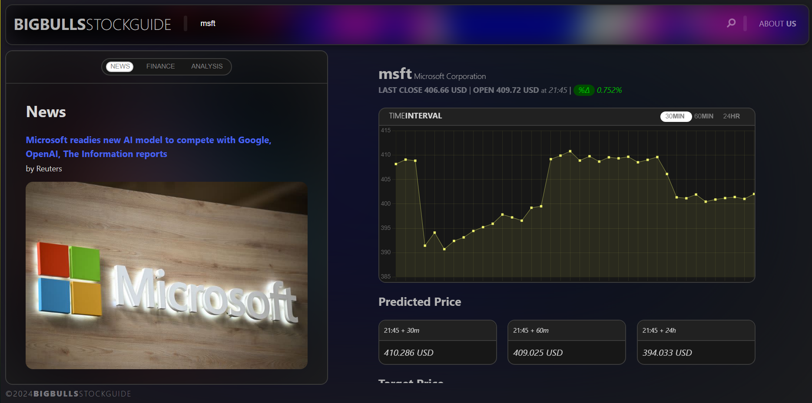
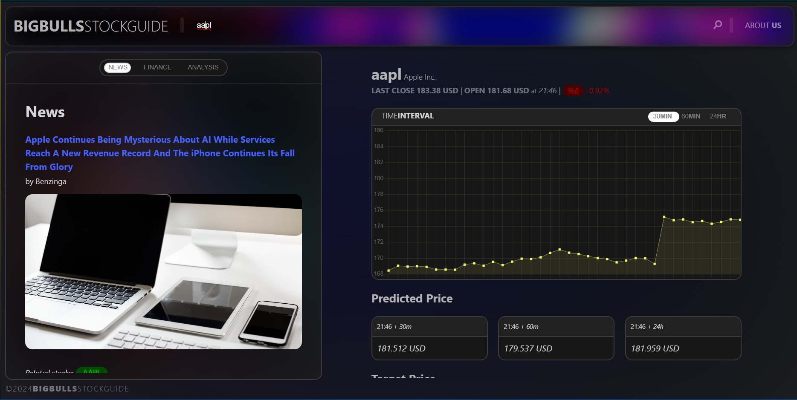

# BIG BULLS STOCK GUIDE

An AI-powered web application designed to guide your stock decisions, now available for local use.

## Overview

BigBullsStockGuide is a comprehensive web application that leverages artificial intelligence to provide users with up-to-date stock information, historical price graphs, news articles, financial details, and analyst perspectives on the stock market. This application serves as a one-stop-shop for informed stock decisions, utilizing React for the frontend and Django for the backend to deliver a seamless user experience.

## Features

- **Real-Time Stock Information**: Access the latest stock prices and market trends.
- **Historical Price Graphs**: Visualize stock performance over various time periods.
- **News Articles and Financial Details**: Stay informed with the latest news and detailed financial information.
- **Analyst Perspectives**: Gain insights from industry experts to support your investment decisions.
- **Predictive Insights**: Utilize machine learning models to predict future stock prices, offering potential predictive insights for investment strategies.

## Technology Stack

- **Frontend**: React
- **Backend**: Django
- **Machine Learning Models**: Custom-built models for stock price prediction
- **APIs**: Yahoo Finance API, REST API
- **Deployment**: Local setup

## Getting Started

### Prerequisites

Ensure you have Python installed on your system. You'll also need to install the following packages:


### Installation

1. Clone this repository,

2. Navigate to the project directory:

   ```bash
   cd BigBullsStockGuide
   ```

3. Create a virtual environment and activate it:

   ```bash
   python -m venv virtualenv
   source virtualenv/bin/activate
   ```

4. Install the required packages:

   ```bash
   pip install -r requirements.txt
   ```

5. Run the Backend Server:

   ```bash
   cd ./backend/BackEnd_API
   python manage.py migrate
   ```

6. Run the front end server and enter the local host link it gives:

   ```bash
   cd ./test-design-project
   npm run dev
   ```

## Contributing

Contributions are welcome Feel free to submit a pull request or open an issue if you encounter any problems.

## Sample Output






